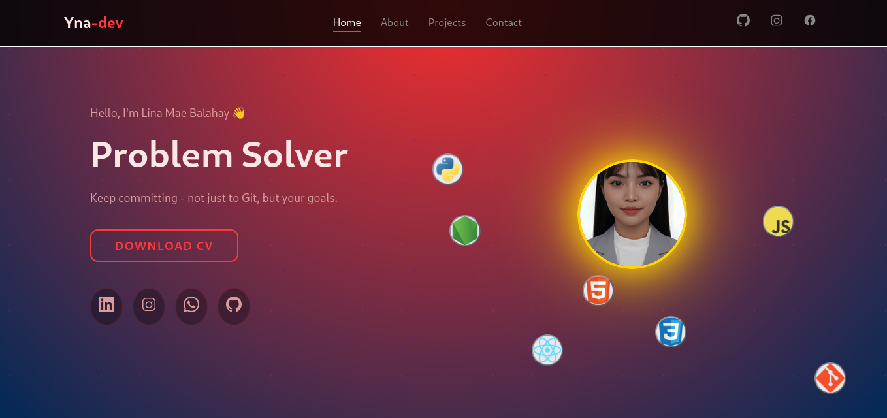

# 🌌 Lina Mae Balahay Portfolio Website

Welcome to my personal 'portfolio website', a modern showcase of my projects, skills, and contact information.  
The website features smooth animations, typing effects, responsive design, and a clean dark red theme.


---

## 🚀 Features

- ⚡ **Responsive Design** — Works perfectly on all devices  
- 🎨 **Typing Effect** — Animated text to showcase skills  
- 🌍 **Smooth Scroll** — Fluid navigation between sections  
- 💻 **Clean Structure** — Modular HTML, CSS, and JS  
- 📧 **Contact Form** — Integrated with [EmailJS](https://www.emailjs.com/) for instant messaging  

---

## 🧠 Tech Stack

| Category | Tools |
|-----------|--------|
| **Frontend** | HTML5, CSS3, JavaScript (ES6+) |
| **Animations** | CSS keyframes, IntersectionObserver |
| **Form Handling** | EmailJS |
| **Deployment** | GitHub Pages |

---

## ⚙️ Setup & Usage

1. **Clone this repository**
   ```bash
   git clone 
   cd 
   
---

## 📬 Contact

- Email: ynacastillo@gmail.com   
- Location: Tagbilaran City  
- LinkedIn: [LinkedIn](https://www.linkedin.com/in/lina-mae-castillo-a09773336/)  
- GitHub: [GitHub](https://github.com/ynacastillo)  
- Instagram: [Instagram](https://www.instagram.com/ynacas22/)

---

Made with ❤️ by **Yna Castillo**
